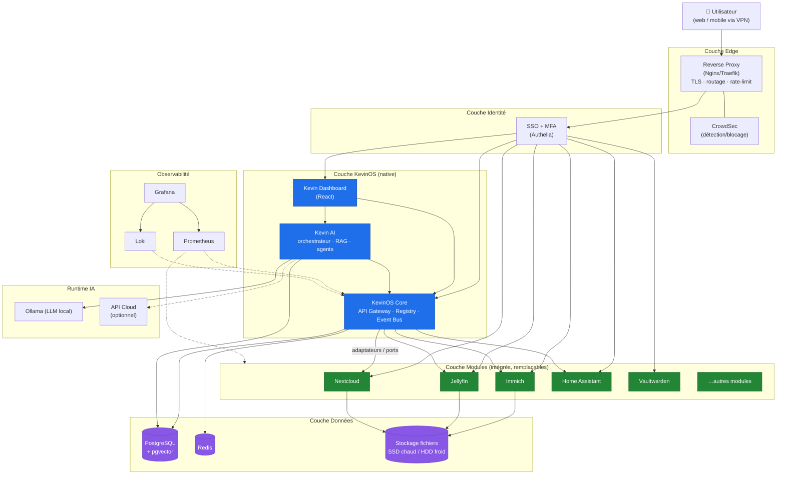

# Diagramme de conteneurs (C4 — niveau 2)

Les couches et conteneurs principaux de KevinOS (architecture Option D).

**Règles illustrées**

- Le **proxy** est le seul point d'entrée ; l'**auth** est traversée avant tout module.
- Le **Dashboard/IA** ne parlent aux modules **que via le Core** (ports/adaptateurs)
  → modules **remplaçables**.
- La couche **Données** n'est jamais joignable depuis l'Edge.
- L'**IA** bascule local ↔ Cloud sans changement de code (provider pluggable).
