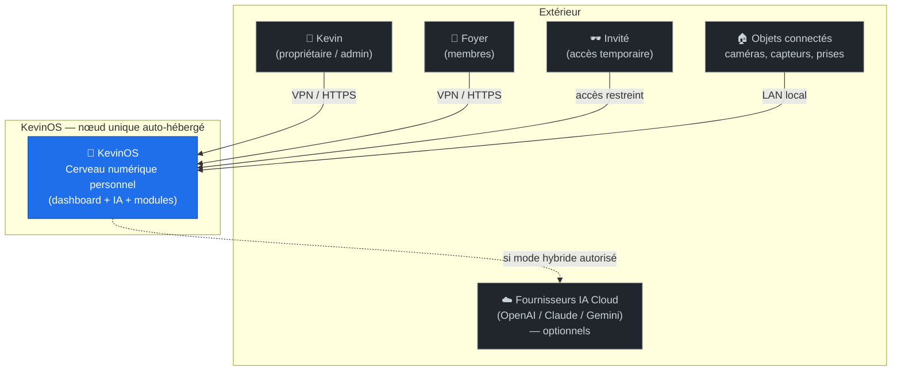

# Diagramme de contexte (C4 — niveau 1)

Qui/quoi interagit avec KevinOS, et où sont les frontières de confiance.

**Points clés**

- L'accès humain distant se fait **par VPN** (frontière de confiance nette).
- Le Cloud IA est **optionnel** et **sortant** : aucune donnée n'y va sans
  décision explicite (souveraineté).
- Les objets connectés restent sur le **LAN local** (pas d'exposition externe).
