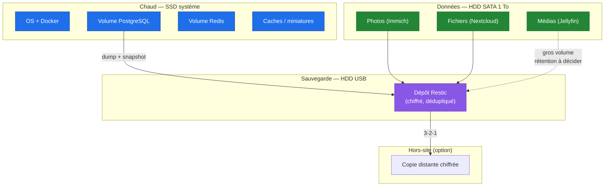

# Diagramme de flux de données & stockage

Où vit chaque donnée et comment elle est sauvegardée. Objectif : respecter la
souveraineté (§ souveraineté) et la règle **3-2-1**.

**Responsabilités de stockage**

| Type | Support | Sauvegarde | Rétention |
|------|---------|-----------|-----------|
| OS / Docker | SSD | Config en Git (IaC) | reconstruit |
| Bases (PostgreSQL) | SSD | **dump + Restic** | longue |
| Redis | SSD | reconstructible (cache) | courte |
| Photos / Documents | HDD SATA | **Restic → USB (+ hors-site)** | longue |
| Médias | HDD SATA/USB | rétention à arbitrer (volume) | à définir |
| Logs / métriques | SSD | rotation | courte–moyenne |

**Règles**

- La donnée **critique** (photos, documents, bases) a toujours **≥ 2 copies sur 2
  supports** ; les HDD USB, moins fiables, ne sont **jamais** l'unique support.
- Sauvegardes **chiffrées** (Restic) ; clé conservée par le propriétaire.
- **Restauration testée** périodiquement (une sauvegarde non testée n'existe pas).
