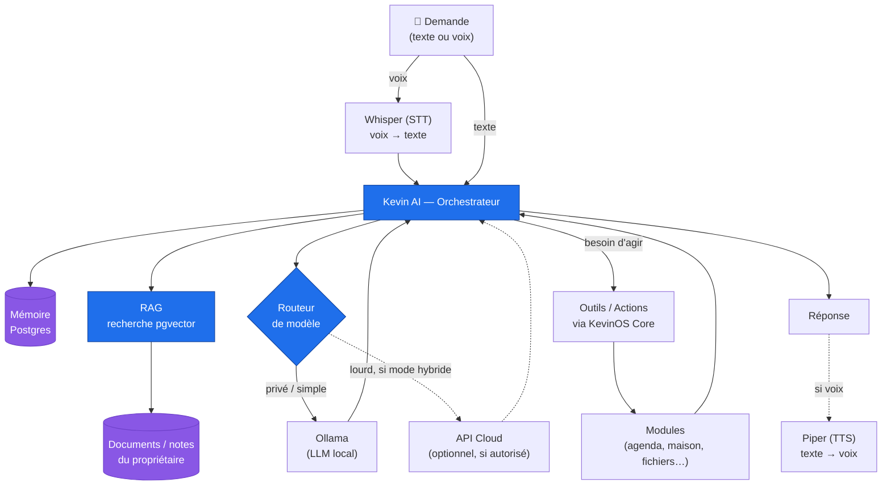

# Diagramme — chaîne de traitement Kevin AI

Comment une demande en langage naturel est traitée : chat, RAG, mémoire, agents.

**Points clés**

- **Provider pluggable** : le *routeur de modèle* choisit local (Ollama) ou Cloud
  selon la sensibilité, la complexité et le mode autorisé — sans changer le code.
- **RAG** ancre les réponses dans les données réelles du propriétaire (pgvector,
  pas de base vectorielle séparée → économie de RAM).
- **Mémoire** persistante = préférences + contexte long terme.
- **Agents** : l'IA agit sur les modules **via le Core**, avec un **compte de
  service à privilèges limités et traçables** (voir [Sécurité §3.3](../05-securite.md)).
- **Voix** (STT/TTS) est une couche optionnelle branchée aux extrémités.
