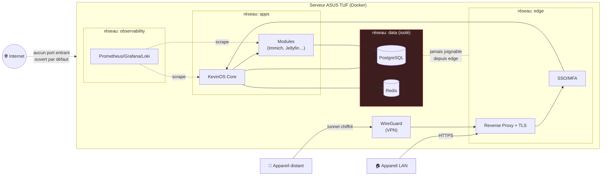

# Diagramme réseau & flux d'accès

Segmentation en réseaux Docker isolés et cheminement d'une requête.

**Principes**

1. **Aucun port entrant ouvert** par défaut : l'accès distant passe par le tunnel
   **WireGuard** (résiste au CGNAT / IP dynamique du partage S21).
2. **Segmentation** : `edge` ne peut pas atteindre `data`. Un module compromis
   n'accède qu'à ce que son réseau autorise.
3. **TLS** de bout en bout, y compris sur le LAN.
4. L'**observabilité** scrute les services mais reste sur son propre réseau.
